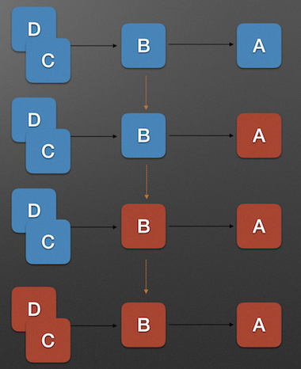

<H1>微服务架构实现-SpringCloud(Finchley)</H1>

# 一、微服务介绍
##（一）微服务定义
##（二）微服务的优势
1. 复杂度可控
2. 独立部署
3. 技术选型灵活
4. 容错、及高可用
5. 扩展性强
# 二、Spring Cloud介绍

##（一）springcloud的核心功能

1. 分布式版本化配置
2. 服务注册与发现
3. 智能路由
4. 负载均衡
5. 熔断器
6. 服务调用
7. 分布式消息传递

# 三、Spring cloud开发

## （一） 服务治理及相关技术

### 1. Netflix套件介绍  
Netflix是Spring Cloud中的一套框架，由Netflix开发,后来并入Spring Cloud，它主要提供的模块包括：服务注册与发现（Eureka）、断路器和监控（hystrix,turbine)、负载均衡(ribbon)、智能路由(zuul)等。
### 2. 服务治理 -Eureka
服务治理是微服务架构中最为核心和基础的模块，主要用来实现各个微服务实例的自动化注册与发现。
- 服务注册：  
    1）在服务治理框架中，通常都会构建一个注册中心，每个微服务（服务单元）都向注册中心登记自己提供的服务，将**主机与端口号、版本号、通信协议**等一些附加信息告知注册中心，注册中心按照服务名分类组织服务清单。  
    2）服务注册以后，会定时以“心跳”的方式向注册中心表明自己可用，若注册中心在规定的时间内不能收到服务的“心跳”，则认为该服务已不可用，需要从服务清单中剔除。如果这一被剔除的服务过一段时间继续向注册中心提供“心跳”，则注册中心会重新将服务加入到注册列表中，继续提供服务。
- 服务发现：
    1）某个服务想使用另一个服务时，服务注册中心可以告知它所需要的服务的实例信息。
    2）Spring Cloud Eureka是Spring Cloud Netflix微服务套件的一部分，负责完成微服务架构中的**服务治理**功能，对Netflix Eureka进行二次封装，实现服务注册与发现，既包括服务端组件，也包含了客户端组件。  
* Eureka的基本架构包括：
    - Register Service:服务注册中心。Eureka server提供服务注册与发现的功能；
    - Provider Servie:服务的提供者，Eureka Client，提供服务；
    - Consumer Service:服务消费者，Eureka Client，消费服务。
* Eureka服务消费的基本过程如下：
    - 创建一个服务注册中心（Eureka Server）；
    - 服务提供者（Eureka Client）向服务注册中心提供服务名、IP地址、端口号、域名等信息注册自己；
    - 服务消费者（Eureka Client)也需向服务注册中心注册，并获取一份服务注册列表，包含所有向服务注册中心注册的服务的信息；
    - 通过列表信息，获取服务提供都的IP地址等信息，通过Http远程调度来消费提供者的服务。
        
    - Eureka作用示意图:
    
    
* Eureka Server的高可用集群

    - Eureka Server可以运行多个实例来构建集群，解决单点失效不可用的问题，Eureka Server集群采用的是点到点对等通信。这是一种去中心化的架构，集群中的每个节点都是平等的，节点通过彼此互相注册来提高可用性，每个节点需要添加一个或多个有效的serviceUrl指向其他节点。
    - 每个节点都可被视为其他节点的副本。当某一台Eureka Server宕机，Eureka Client的请求会自动切换到其他的Eureka Server节点，当宕机的服务器重新恢复后，Eureka也会再次将其纳入集群管理之中。当节点开始接受客户端请求时，所有的操作都会进行replicateToPeer（节点间复制）操作，将请求复制到其他Eureka Server当前所知的所有节点中。
    - 一个Eureka Server新节点启动后，会首先尝试从邻近节点获取所有实例注册表信息，完成初始化。Eureka Server通过getEurekaServiceUrls()方法获取所有的节点，并且会通过“心跳”续约的方式定期更新。默认配置下，如果Eureka Server在一定时间内没有接收到某个服务实例的心跳，Eureka Server将会注销该实例（默认为 90 秒，通过eureka.instance.lease-expiration-duration-in-seconds配置）。当Eureka Server节点在短时间内丢失过多的心跳时（比如发生了网络分区故障），那么这个节点就会进入自我保护模式。
    - 下图为Eureka官网的架构图：
    

* 自我保护模式

    如果在 Eureka Server 的首页看到以下这段提示，则说明 Eureka 已经进入了保护模式。
    
    >EMERGENCY! EUREKA MAY BE INCORRECTLY CLAIMING INSTANCES ARE UP WHEN THEY’RE NOT. RENEWALS ARE LESSER THAN THRESHOLD AND HENCE THE INSTANCES ARE NOT BEING EXPIRED JUST TO BE SAFE.
    
    默认配置下，如果 Eureka Server 每分钟收到心跳续约的数量低于一个阈值，并且持续 15 分钟，就会触发自我保护。
    >1阈值=instance的数量 × (60 / instance的心跳间隔秒数) × 自我保护系数  

    在自我保护模式中，Eureka Server会保护服务注册表中的信息，不再注销任何服务实例。当它收到的心跳数重新恢复到阈值以上时，该Eureka Server节点就会自动退出自我保护模式。它的设计哲学是宁可保留错误的服务注册信息，也不盲目注销任何可能健康的服务实例。这样做会使客户端很容易拿到实际已经不存在的服务实例，会出现调用失败的情况。因此客户端要有容错机制，比如请求重试、断路器。该模式可以通过eureka.server.enable-self-preservation = false来禁用，同时eureka.instance.lease-renewal-interval-in-seconds可以用来更改心跳间隔（默认 30s），eureka.server.renewal-percent-threshold可以用来修改自我保护系数（默认 0.85）。

### 3. 负载均衡——Ribbon

Ribbon主要功能是为REST客户端实现负载均衡,主要包括六个组件：
- ServerList，负载均衡使用的服务器列表。这个列表会缓存在负载均衡器中，并定期更新。当Ribbon与 Eureka结合使用时，ServerList的实现类就是DiscoveryEnabledNIWSServerList，它会保存Eureka Server中注册的服务实例表。
- ServerListFilter，服务器列表过滤器。这是一个接口，主要用于对Service Consumer获取到的服务器列表进行预过滤，过滤的结果也是ServerList。Ribbon提供多种过滤器的实现。
- IPing，探测服务实例是否存活的策略。
- IRule，负载均衡策略，其实现类表述的策略包括：轮询、随机、根据响应时间加权等，其类结构如下图所示。


>我们可以自己定义负载均衡策略，比如我们就利用自己实现的策略，实现了服务的版本控制和直连配置。实现好之后，将实现类重新注入到 Ribbon 中即可。

- ILoadBalancer，负载均衡器。这也是一个接口，Ribbon为其提供了多个实现，比如ZoneAwareLoadBalancer。而上层代码通过调用其API进行服务调用的负载均衡选择。一般ILoadBalancer的实现类中会引用一个 IRule。
- RestClient，服务调用器。顾名思义，这就是负载均衡后，Ribbon向Service Provider发起REST请求的工具。

Ribbon 工作时会做四件事情：

- 优先选择在同一个Zone且负载较少的Eureka Server；
- 定期从Eureka更新并过滤服务实例列表；
- 根据用户指定的策略，在从Server取到的服务注册列表中选择一个实例的地址；
- 通过RestClient进行服务调用。
### 4. 服务调用端熔断——Hystrix
- 雪崩效应
    在微服务架构中通常会有多个服务层调用，基础服务的故障可能会导致级联故障，进而造成整个系统不可用的情况，这种现象被称为服务雪崩效应。服务雪崩效应是一种因“服务提供者”的不可用导致“服务消费者”的不可用,并将不可用逐渐放大的过程。
    如果下图所示：A作为服务提供者，B为A的服务消费者，C和D是B的服务消费者。A不可用引起了B的不可用，并将不可用像滚雪球一样放大到C和D时，雪崩效应就形成了。
    
- 熔断器
    Hystrix，是Netflix实现的“断路器”保护的库，“断路器”本身是一种开关装置，当一个服务发生故障时，调用服务的请求失败次数达到一定的阀值时，熔断开关打开，所有请求执行快速失败，不执行业务逻辑，这样就保证了服务调用方的线程不会被长时间、不必要地占用，避免了故障在分布式系统中的蔓延，乃至雪崩。
    处于打开状态的熔断器，一段时间后，会处于半打开状态，执行一定数量的请求，如果请求成功，则将熔断器关闭，恢复正常，反之则继续打开熔断器。
    
    熔断机制的意义如下：
    （1）资源隔离。服务出现故障，会隔离出现故障的资源的API，执行快速失败逻辑，不会形成阻塞，造成“雪崩”效应发生，进入导致系统崩溃。
    （2）服务降级功能。当服务处于正常状态时，大量请求在短时间内涌入，超过了服务的处理能力，这时熔断器也会被打开，将服务降级，以免系统崩溃。
    （3）自我修复能力。这个能力至关重要，当因某个微小的故障，导致熔断器被打开，如果不能自我监控，自我修复，而是靠人工去关闭熔器，工作量会巨大。
- 监控
    除了隔离依赖服务的调用以外，Hystrix还提供了准实时的调用监控（Hystrix Dashboard），Hystrix会持续地记录所有通过Hystrix发起的请求的执行信息，并以统计报表和图形的形式展示给用户，包括每秒执行多少请求多少成功，多少失败等。Netflix通过hystrix-metrics-event-stream项目实现了对以上指标的监控Spring Cloud也提供了Hystrix Dashboard的整合，对监控内容转化成可视化界面，Hystrix Dashboard Wiki上详细说明了图上每个指标的含义。
    

### 5. 服务调用端代码抽象和封装——Feign
    
Feign整合了Ribbon和Hystrix，采用了声明式API接口风格，将Java Http客户端绑定到它的内部，使Java HTTP调用过程变的简单。  
Feign 具有如下特性：
- 可插拔的注解支持，包括Feign注解和JAX-RS注解
- 支持可插拔的HTTP编码器和解码器
- 支持Hystrix和它的Fallback
- 支持Ribbon的负载均衡
- 支持HTTP请求和响应的压缩


##（二）服务注册与发现
### 1. 服务注册中心（Eureka server)
Spring Cloud使用Netfilx的Eureka实现服务注册中心，只需要很简单的几个步骤就可以完成注册中心的搭建。
- 在Idea中使用Initializr创建一个spring boot project或者Module，并在选择spring cloud依赖的时候选择Eureka server,如下图所示：
      
    创建项目完成后，pom.xml文件中应该包含如下代码：
        
    ```
        <dependencies>
            <dependency>
                <groupId>org.springframework.cloud</groupId>
                <artifactId>spring-cloud-starter-netflix-eureka-server</artifactId>
            </dependency>
        </dependencies>
    ```
- 通过在一个普通的 Spring Boot 应用中添加@EnableEurekaServer注解就能启动一个服务注册中心并提供给其他应用。
    ```
    @EnableEurekaServer
    @SpringBootApplication
    public class EurekaServerApplication {

        public static void main(String[] args) {
            SpringApplication.run(EurekaServerApplication.class, args);
        }
    }
    ```
- 配置文件application.yml内容如下：
    ```
    spring:
        application:
        name: eureka-server
    server:
        port: 8761
    eureka:
        instance:
        hostname: localhost
        client:
        register-with-eureka: false
        fetch-registry: false
        service-url:
            defaultZone: http://${eureka.instance.hostname}:${server.port}/eureka/
    ```

    ```
    server.port：为了与后续要进行注册的服务区分，这里将服务注册中心的端口设置为7000。
    eureka.client.register-with-eureka：表示是否将自己注册到Eureka Server，默认为true。
    eureka.client.fetch-registry：表示是否从Eureka Server获取注册信息，默认为 true。
    eureka.client.service-url.defaultZone：设置与Eureka Server交互的地址，查询服务和注册服务都需要依赖这个地址。默认是http://localhost:8761/eureka；多个地址可使用英文逗号（,）分隔。
    ```
    启动工程后，访问 http://localhost:8761/。如下：  
          

### 2. 高可用注册中心集群    
    
注册中心属于关键服务，在一个分布式系统中，服务注册中心是最重要的基础设施，如果单点部署，遇到故障后其它服务都将会出现问题或者无法启动或使用。因此，服务注册中心必须时时处于高可用状态，随时可以提供注册服务。Eureka通过互相注册的方式来实现高可用的部署，配置简单，只需要将Eureke Server的service-url配置为其他可用的Eureka Server的service-url即可。
- 三个Eureka Server集群的配置文件示例：
    ```
    ---
    spring:
      application:
        name: eureka-server
      profiles:
        active: peer1
    server:
      port: 8761
    eureka:
      instance:
        hostname: peer1
      client:
        register-with-eureka: true
        fetch-registry: true
        service-url:
          defaultZone: http://peer2:8762/eureka/,http://peer3:8763/eureka/

    ---
    spring:
      application:
        name: eureka-server
      profiles:
        active: peer2
    server:
      port: 8762
    eureka:
      instance:
        hostname: peer2
      client:
        register-with-eureka: true
        fetch-registry: true
        service-url:
          defaultZone: http://peer1:8761/eureka/,http://peer3:8763/eureka/
    ---
    spring:
      application:
        name: eureka-server
      profiles:
        active: peer3
    server:
      port: 8763
    eureka:
      instance:
        hostname: peer3
      client:
        register-with-eureka: true
        fetch-registry: true
        service-url:
          defaultZone: http://peer1:8761/eureka/,http://peer2:8762/eureka/
    ```

- 配本地 host：
    在/etc/hosts文件中加入如下配置
    ```
    127.0.0.1 peer1 peer2 peer3
    ```
- 两种启动方式：
    1. 打包后启动
        在终端中直接输入如下命令：  

        ```
        $ mvn clean package  -Dmaven.test.skip=true
        $ java -jar target/eureka-server-0.0.1-SNAPSHOT.jar  --spring.profiles.active=peer1
        $ java -jar target/eureka-server-0.0.1-SNAPSHOT.jar  --spring.profiles.active=peer2
        $ java -jar target/eureka-server-0.0.1-SNAPSHOT.jar  --spring.profiles.active=peer3
        ```
        >后面的三个命令可能需要在三个终端中分别输入。
    2. 直接在Idea中配置并启动
            
            复制三个应用启动配置项。
            
    分别设置Active profiles域和增加Override parameters项“server.port = 8761"。
- 在刚启动peer1的时候，启动完成后会在控制台看到一些异常信息，大致就是拒绝连接、请求超时这一类的，这个不用管，启动peer2 peer3后就好了。
    
##（三）服务提供与调用Eureka
### 1. 三个角色及关系、应用流程
- Eureka实现的服务提供与调用的方案中有三个角色：服务注册中心（Eureka Server)、服务提供者、服务消费者。
- 作用关系：
    
- 流程如下：
    - 启动服务注册中心
    - 服务提供者生产服务并注册到服务中心中
    - 消费者从服务中心中获取服务并执行

### 2. 服务提供者

服务提供者提供一个startwork()方法，可以根据传入的参数，提供输出“I'm xxx,I'll start to work,The time is:当前时间” 的服务。

- POM包配置
  创建Spring Boot应用eureka-producer，在pom.xml中添加如下配置：
    ```
    <dependency>
        <groupId>org.springframework.boot</groupId>
        <artifactId>spring-boot-starter-web</artifactId>
    </dependency>
    <dependency>
        <groupId>org.springframework.cloud</groupId>
        <artifactId>spring-cloud-starter-netflix-eureka-client</artifactId>
    </dependency>
    ```
- 配置文件
application.yml 配置如下
    ```
    spring:
      application:
        name: eureka-producer
    eureka:
      client:
        service-url:
          defaultZone: http://localhost:7000/eureka/
    server:
      port: 8770
    ```
    ```
    说明：
    1. spring.application.name属性指定微服务的名称，后续在调用时使用该名称就可以进行服务的访问。
    2. eureka.client.serviceUrl.defaultZone属性与服务注册中心的配置一致，指定服务注册中心的位置。
    ```

- 启动类
Spring Cloud在Finchley版中不需要在启动类上添加@EnableDiscoveryClient注解就可以启动注册客户端。
如果引入了相关的jar包又想禁用服务注册与发现则可以通过设置eureka.client.enabled=false实现。
    ```
    @EnableDiscoveryClient is no longer required. You can put a DiscoveryClient implementation on the classpath to cause the Spring Boot application to register with the service discovery server.
    Spring Cloud - @EnableDiscoveryClient
    ```
    ```
    /*
    *Class EurekaProducerApplication
    */
    @SpringBootApplication
    public class EurekaProducerApplication {

        public static void main(String[] args) {
            SpringApplication.run(EurekaProducerApplication.class, args);
        }

    }
    ```
- Controller
提供startwork服务:
    ```
    @RestController
    @RequestMapping("/workstart")
    public class HelloController {

        @GetMapping("/")
        public String hello(@RequestParam String name) {
            return “I'm " + name + ",I'll start to work, The time is: " + new Date();
        }

    }
    ```
启动工程后，就可以在注册中心Eureka的页面看到eureka-server服务。

### 3. 服务消费者

创建服务消费者根据使用API的不同，可分为三种方式：
- 使用 LoadBalancerClient；
- 使用Spring Cloud Ribbon；
- 使用Spring Cloud Feign。
在实际使用中用的都是Spring Cloud Feign,所以只写一下使用Feign的方法。
Feign是声明式调用，例子如下：

- POM 包配置

创建一个基本的Spring Boot应用eureka-producer-feign，在pom.xml中添加如下配置：
```
<dependency>
    <groupId>org.springframework.boot</groupId>
    <artifactId>spring-boot-starter-web</artifactId>
</dependency>
<dependency>
    <groupId>org.springframework.cloud</groupId>
    <artifactId>spring-cloud-starter-openfeign</artifactId>
</dependency>
<dependency>
    <groupId>org.springframework.cloud</groupId>
    <artifactId>spring-cloud-starter-netflix-eureka-client</artifactId>
</dependency>
```

- application.yml配置如下
```
spring:
  application:
    name: eureka-consumer
eureka:
  client:
    service-url:
      defaultZone: http://localhost:8761/eureka/ # 指定 Eureka 注册中心的地址
server:
  port: 9000 # 分别为 9000、9001、9002

```

- 启动类

在启动类上加上@EnableFeignClients
```
@EnableFeignClients
@SpringBootApplication
public class EurekaConsumerFeignApplication {

    public static void main(String[] args) {
        SpringApplication.run(EurekaConsumerFeignApplication.class, args);
    }
}
```
- Feign 调用实现

创建一个Feign的客户端接口定义。使用@FeignClient注解来指定这个接口所要调用的服务名称，接口中定义的各个函数使用Spring MVC的注解就可以绑定服务提供者的 RESTful接口，如下：

@FeignClient(name = "eureka-producer")
public interface StartWorkRemote {

    @GetMapping("/startwork/")
    String hello(@RequestParam(value = "name") String name);
}
此类中的方法和远程服务中Contoller中的方法名和参数需保持一致。

- Controller

修改 Controller，将 HelloRemote 注入到 controller 层，像普通方法一样去调用即可

```
@RequestMapping("/startwork")
@RestController
public class StartWorkController {

    @Autowired
    StartWorkRemote startWorkRemote;

    @GetMapping("/{name}")
    public String index(@PathVariable("name") String name) {
        return startWorkRemote.startwork(name + "!");
    }
}
```
通过Spring Cloud Feign来实现服务调用的方式非常简单，通过@FeignClient定义的接口来统一的声明我们需要依赖的微服务接口。而在具体使用的时候就跟调用本地方法一样进行调用即可。由于Feign是基于Ribbon实现的，所以它自带了客户端负载均衡功能，也可以通过Ribbon的IRule进行策略扩展。另外，Feign还整合了Hystrix来实现服务的容错保护。