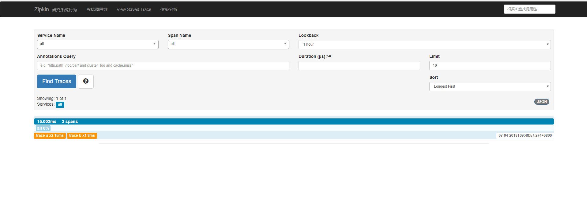
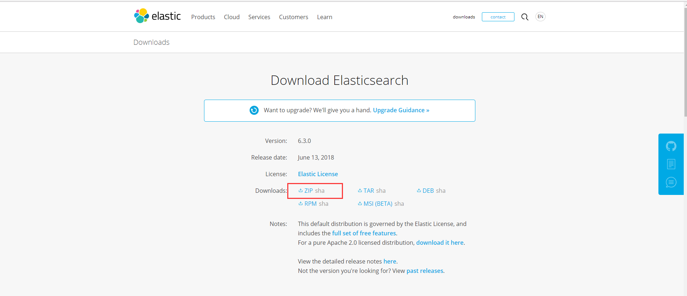
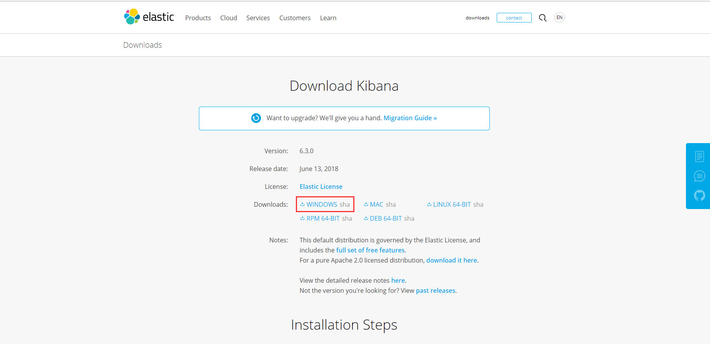
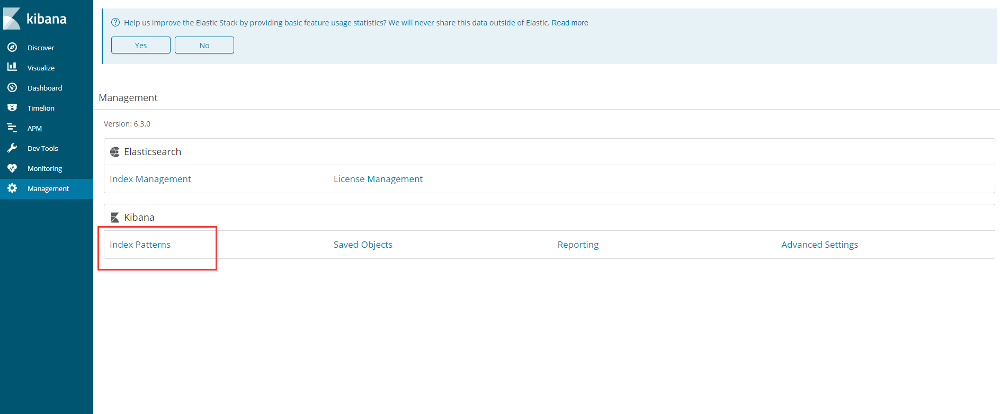
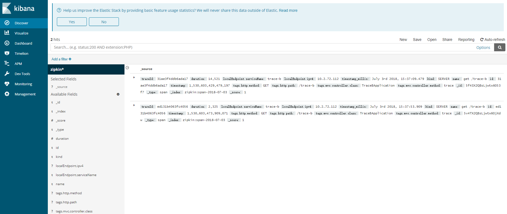

# 十一、Spring Cloud Sleuth
## （一） Spring Cloud Sleuth意义
 &emsp;一个微服务系统中会有众多微服务单元，业务也较为复杂，各个服务单元之间会相互消费，如果某一业务中的某一个服务节点出现问题，将会很难定位。所以在微服务系统中必须够进行链路追踪，对每个请求都能够清晰可见，记录展示请求都有哪些服务参与，这样可以在出现问题时能够快速定位。\
 &emsp;当前常见的链路追踪组件有Google的Dapper，Twitter的Zipkin，以及阿里的Eagleeye等。下面我们将讲解如何适用zipkin进行服务链路追踪。
## （二） 案例讲解
&emsp;再接下来的案例中使用Spring Boot的版本为2.0.3RELEASE，Spring Cloud的版本为Finchley.RELEASE,本案例采用Maven工程的多Module形式，工程中总共有三个module，eureka-server作为注册中心，trace-a、trace-b作为两个zipkin client，负责产生链路数据，并上传给链路追踪的服务中心。\
&emsp;需要特别注意的是在，Spring Boot 2.X以前，服务链路追踪的服务中心是需要自己创建的,但是在Spring Boot2.X版本之后，官方就不推荐自行定制服务端了，而是提供一个编译好的jar包供我们使用。

### 1. Eureka Server
    在编写服务注册中心eureka-server之前先建立一个Maven主工程sleuth-zipkin，在主Maven工程中引入其内部module所需的共同依赖：Spring Boot 2.0.3X和Spring Cloud Finchley.RELEASE,主Maven工程的pom文件如下：
```xml
<?xml version="1.0" encoding="UTF-8"?>
    <project xmlns="http://maven.apache.org/POM/4.0.0" xmlns:xsi="http://www.w3.org/2001/XMLSchema-instance"
         xsi:schemaLocation="http://maven.apache.org/POM/4.0.0 http://maven.apache.org/xsd/maven-4.0.0.xsd">
    <modelVersion>4.0.0</modelVersion>

    <groupId>com.example</groupId>
    <artifactId>demo</artifactId>
    <version>0.0.1-SNAPSHOT</version>
    <packaging>jar</packaging>

    <name>demo</name>
    <description>Demo project for Spring Boot</description>

    <parent>
        <groupId>org.springframework.boot</groupId>
        <artifactId>spring-boot-starter-parent</artifactId>
        <version>2.0.3.RELEASE</version>
        <relativePath/> <!-- lookup parent from repository -->
    </parent>

    <properties>
        <project.build.sourceEncoding>UTF-8</project.build.sourceEncoding>
        <project.reporting.outputEncoding>UTF-8</project.reporting.outputEncoding>
        <java.version>1.8</java.version>
        <spring-cloud.version>Finchely.RELEASE</spring-cloud.version>
    </properties>

    <dependencyManagement>
        <dependencies>
            <dependency>
                <groupId>org.springframework.cloud</groupId>
                <artifactId>spring-cloud-dependencies</artifactId>
                <version>${spring-cloud.version}</version>
                <type>pom</type>
                <scope>import</scope>
            </dependency>
        </dependencies>
    </dependencyManagement>

    <build>
        <plugins>
            <plugin>
                <groupId>org.springframework.boot</groupId>
                <artifactId>spring-boot-maven-plugin</artifactId>
            </plugin>
        </plugins>
    </build>
</project>
```
&emsp;创建完Maven主工程后，在主工程下面创建一个新的module工程，命名为eureka-server，作为微服务的注册中心，在eureka-server的pom文件中集成主Maven工程，引入eureka server所需的起步依赖spring-cloud-starter-netflix-eureka-server、spring-boot-starter-test，该pom文件如下：
```xml
<parent>
    <groupId>com.cnhtcqk</groupId>
    <artifactId>sleuth-zipkin</artifactId>
    <version>1.0-SNAPSHOT</version>
</parent>

<dependencies>
    <dependency>
        <groupId>org.springframework.cloud</groupId>
        <artifactId>spring-cloud-starter-netflix-eureka-server</artifactId>
    </dependency>

    <dependency>
        <groupId>org.springframework.boot</groupId>
        <artifactId>spring-boot-starter-test</artifactId>
        <scope>test</scope>
    </dependency>
</dependencies>

<build>
    <plugins>
        <plugin>
            <groupId>org.springframework.boot</groupId>
            <artifactId>spring-boot-maven-plugin</artifactId>
        </plugin>
    </plugins>
</build>
```
&emsp;在配置文件application.yml文件中做相关配置：
```yml
#指定端口为8761
server:
  port: 8761
#防止eureka-server注册自己，同时配置注册中心注册地址
eureka:
  client:
    register-with-eureka: false
    fetch-registry: false
    service-url:
      defaultzone: http://localhost:${server.port}/eureka/
```
&emsp;在工程的启动类EurekaServerApplication中添加注解@EnableEurekaServer打开作为注册中心的功能，代码如下：
```java
@SpringBootApplication
@EnableEurekaServer
public class EurekaServerApplication {
    public static void main(String[] args) {
        SpringApplication.run(EurekaServerApplication.class, args);
    }
}
```
### 2. zipkin服务端
&emsp;在Spring Boot 2.X后需要下载官方提供的zipkin的jar包作为服务端，使用curl下载如下：在git命令行下运行下面语句，将会下载zipkin.jar到当前目录下。
```cmd
curl -sSL https://zipkin.io/quickstart.sh | bash -s
```
&emsp;zipkin.jar实际上就是一个spring Boot工程，可以使用java -jar的形式启动，如下
```cmd
java -jar zipkin.jar
```
&emsp;如果不指定zipkin server的端口，启动后将默认使用9411，此时访问http://localhost:9411/zipkin/将会看到以下界面：
### 3. zipkin客户端
&emsp;在主Maven工程下新建一个module工程，命名为trace-a，需要引入以下依赖：
```xml
<dependency>
    <groupId>org.springframework.boot</groupId>
    <artifactId>spring-boot-starter-webflux</artifactId>
</dependency>
<dependency>
    <groupId>org.springframework.cloud</groupId>
    <artifactId>spring-cloud-starter-netflix-eureka-client</artifactId>
</dependency>
<dependency>
    <groupId>org.springframework.cloud</groupId>
    <artifactId>spring-cloud-starter-sleuth</artifactId>
</dependency>
<dependency>
    <groupId>org.springframework.cloud</groupId>
    <artifactId>spring-cloud-starter-zipkin</artifactId>
</dependency>
```
&emsp;在配置文件application.yml中做如下配置：
```yml
spring:
  application:
    name: trace-a #指定工项目名
  sleuth:
    web:
      client:
        enabled: true #打开sleuth客户端功能
    sampler:
      probability: 1.0 #将采样比设置为1，全部采样，默认为0.1
  zipkin:
    base-url: http://localhost:9411/ #指定链路追踪服务地址
server:
  port: 8762 
eureka:
  client:
    service-url:
      defaultzone: http://localhost:8761/eureka/ #指定服务注册中心地址
```
&emsp;Spring Cloud Finchley.RELEASE版本正式发布后，增加的一个新特性就是在引入eureka-client启动依赖后不需要在启动类中配置注解@EnableEurekaClient,spirng cloud会自动开启向注册中心注册功能，如果不需要开启注册功能只需要在配置文件中配置eureka.client.enable=false\
&emsp;按照上述的方法建立第二个zipkin客户端，命名为trace-b,trace-b的创建方法和trace-a基本一致，不同的知识配置文件中的spring.application.name和server.port两项。
&emsp;在trace-a工程下启动类下添加接口用来测试链路追踪，代码如下:
trace-a启动类
```java
@SpringBootApplication
@EnableEurekaClient
@RestController

public class TraceAApplication {

    public static void main(String[] args) {
        SpringApplication.run(TraceAApplication.class, args);
    }

    @Autowired
    private LoadBalancerExchangeFilterFunction lbFunction;

    @Bean
    public WebClient webClient() {
        return WebClient.builder().baseUrl("http://trace-b")
                .filter(lbFunction)
                .build();
    }

    @GetMapping("/trace-a")
    public Mono<String> trace() {
        System.out.println("===call trace-a===");

        return webClient().get()
                .uri("/trace-b")
                .retrieve()
                .bodyToMono(String.class);
    }
}
```
trace-b启动类
```java
@SpringBootApplication
@EnableEurekaClient
@RestController
public class TraceBApplication {

    public static void main(String[] args) {
        SpringApplication.run(TraceBApplication.class, args);
    }

    @GetMapping("/trace-b")
    public Mono<String> trace() {
        System.out.println("===call trace-b===");

        return Mono.just("Trace");
    }
}
```
&emsp;从上面的可以看出，调用/trace-a接口时，/trace-a接口会调用/trace-b接口。
分别启动eureka-server、zipkin、trace-a、trace-b，分别访问http:localhost:8762/trace-a和http:localhost:8763/trace-b,这时访问http:localhost:9411/zipkin/并点击Find Trace按钮可以看到链路追踪的记录，如下图所示：


点击每一条记录进去可以看到每一个服务的时间和顺序。


### 4.使用rabbitMQ传输链路数据
&emsp;在上述例子中zipkin server 是通过http收集链路数据的，下面讲解如何使用消息组件RabbitMQ获取链路数据。
&emsp;使用RabbitMq需要对两个zipkin客户端进行改动，只需要在原有的基础上spring-cloud-stream-binder-rabbit依赖，其他不许要改动。
```xml
<dependency>
    <groupId>org.springframework.cloud</groupId>
    <artifactId>spring-cloud-stream-binder-rabbit</artifactId>
</dependency>
```
&emsp;同样zipkin server也需要做相应的修改，但是官方已经将其封装为jar包，只需要在启动时修改相应的配置即可。我们可以在启动时指定让zipkin从RabbitMQ中读取信息，如下
```cmd
java -jar --zipkin.collector.rabbitmq.addresses=localhost
```
除了上述方法我们也可以直接通过修改配置中的RABBITMQ_ADDRESSES常量
&emsp;上述配置是写在官方jar包的配置文件中的，下面附上jar包中RabiitMQ相关的配置:
```yml
zipkin:
    collector:
        rabbitmq:
            # RabbitMQ server address list (comma-separated list of host:port)
            addresses: ${RABBIT_ADDRESSES:}
            concurrency: ${RABBIT_CONCURRENCY:1}
            # TCP connection timeout in milliseconds
            connection-timeout: ${RABBIT_CONNECTION_TIMEOUT:60000}
            password: ${RABBIT_PASSWORD:guest}
            queue: ${RABBIT_QUEUE:zipkin}
            username: ${RABBIT_USER:guest}
            virtual-host: ${RABBIT_VIRTUAL_HOST:/}
            useSsl: ${RABBIT_USE_SSL:false}
            uri: ${RABBIT_URI:}
```
&emsp;另外，zipkin.jar的配置文件可以在此链接下查看:<https://github.com/openzipkin/zipkin/blob/master/zipkin-server/src/main/resources/zipkin-server-shared.yml>\
&emsp;至此，RabbitMQ获取链路数据的服务端和客户端都已完成，分别启动eureka-server、trace-a、trace-b、zipkin.jar。完后访问http://localhost:8762/trace-a接口，并点击zipkin server页面的Find Traces按钮，可以看到以下页面，说明使用RabbitMQ传输数据成功。

&emsp;为了确定是使用的RabbtMQ传输数据，而不是Http，可以将trace-a与trace-b工程中的spring.zipkin.base-url配置修改为一个错误的地址，或者直接屏蔽掉。在zipkin的配置文件中配置的访问RabbitMQ的账号和密码都默认是guest，如果你的RabbitMQ的账号或密码不是guest，需要在启动zipkin.jar时修改。
### 5.使用MySQL存储链路数据
&emsp;在上面的案例中，zipkin收集到的链路数据都是储存在内存中的，zipkin服务端重启后，链路数据都会消失，我们可以通过数据库的方式储存链路数据。
&emsp;在接下来的案例中使用mysql数据库存储链路数据,获取链路数据的方式采用RabbitMQ,首先需要创建所需要的数据表，数据库脚本文件的地址为：<https://github.com/openzipkin/zipkin/blob/master/zipkin-storage/mysql-v1/src/main/resources/mysql.sql>，脚本将会创建zipkin_spans、zipkin_annotations、zipkin_dependencies三个表。\
&emsp;使用mysql存储链路数据非常简单，在官方提供的zipkin.jar中已经集成所需要的依赖，只需要再启动时修改相应的配置即可，下面是相应的配置。
 ```yml
 zipkin:
    collector:
        storage:
            type: ${STORAGE_TYPE:mem} #zipkin存储方式
            mysql:
                host: ${MYSQL_HOST:localhost} #数据库服务器地址
                port: ${MYSQL_TCP_PORT:3306} #端口号
                username: ${MYSQL_USER:} #用户名
                password: ${MYSQL_PASS:} #密码
                db: ${MYSQL_DB:zipkin} #数据库名
                max-active: ${MYSQL_MAX_CONNECTIONS:10} #最大连接数
                use-ssl: ${MYSQL_USE_SSL:false} #是否使用ssl连接
```
&emsp;以下为启动zipkin.jar时的参考语句。
```cmd
java -jar zipkin.jar 
--zipkin.collector.rabbitmq.addresses=localhost --zipkin.storage.type=mysql
--zipkin.storage.mysql.host=localhost --zipkin.storage.mysql.port=3306 
--zipkin.storage.mysql.username=root  --zipkin.storage.mysql.password=12345678 
--zipkin.storage.mysql.db=zipkin --zipkin.storage.mysql.use-ssl=false
```
或者采用如下方式：
```cmd
java -jar zipkin.jar 
--RABBIT_ADDRESSES=localhost --STORAGE_TYPE=mysql 
--MYSQL_HOST=localhost --MYSQL_TCP_PORT=3306 
--MYSQL_USER=root --MYSQL_PASS=12345678 
--MYSQL_DB=zipkin --MYSQL_USE_SSL=false
```
重新启动工程后，访问http://localhost:8762/trace-a接口，点击Find Trace按钮会看看有一条记录，而且数据库的表中会多了本次调用的链路追踪数据，如果此时重启zipkin.jar，再次点击Find Trace会发现上条记录依然存在，说明使用mysql数据库确实存储了链路数据
### 6.使用ElasticsSearch存储链路数据
&emsp;如果系统请求量很大，高并发的情况下，使用mysql存储链路数据必然有不合理之处，这时可以采用ElasticSearch存储数据，需要安装ElasticSearch，压缩包的下载地址为<https://www.elastic.co/downloads/elasticsearch>,windows系统中,选择下图中的ZIP包下载即可：

下载解压后在bin目录下双击elasticsearch.bat即可启动，9200是ES对外的RESTFul接口，在浏览器中访问http://localhost:9200如果有以下输出说明安装成功：
```json
{
  "name" : "iCXVoe1",
  "cluster_name" : "elasticsearch",
  "cluster_uuid" : "Js9ioT60SBiUVooE_mY_MQ",
  "version" : {
    "number" : "6.3.0",
    "build_flavor" : "default",
    "build_type" : "zip",
    "build_hash" : "424e937",
    "build_date" : "2018-06-11T23:38:03.357887Z",
    "build_snapshot" : false,
    "lucene_version" : "7.3.1",
    "minimum_wire_compatibility_version" : "5.6.0",
    "minimum_index_compatibility_version" : "5.0.0"
  },
  "tagline" : "You Know, for Search"
}
```
&emsp;以上输出的各项的含义可以自行查询。如果需要对ES进行其他配置，可以在config/elasticsearch.yml中进行配置。
&emsp;本节的案例与上节类似，不需要对程序进行修改，只需要在启动zipkin.jar的时候修改相应的配置即可，需要先指定zipkin的存储类型为elasticsearch，指定ElasticSearch的服务器地址等，下面是zipkin.jar中的关于elasticsearch的配置。
```yml
 zipkin:
    collector:
        storage:
            type: ${STORAGE_TYPE:mem} #zipkin存储方式
            elasticsearch:
                # host is left unset intentionally, to defer the decision
                hosts: ${ES_HOSTS:}
                pipeline: ${ES_PIPELINE:}
                max-requests: ${ES_MAX_REQUESTS:64}
                timeout: ${ES_TIMEOUT:10000}
                index: ${ES_INDEX:zipkin}
                date-separator: ${ES_DATE_SEPARATOR:-}
                index-shards: ${ES_INDEX_SHARDS:5}
                index-replicas: ${ES_INDEX_REPLICAS:1}
                username: ${ES_USERNAME:}
                password: ${ES_PASSWORD:}
                http-logging: ${ES_HTTP_LOGGING:}
                legacy-reads-enabled: ${ES_LEGACY_READS_ENABLED:true}
```
&emsp;按照如下方式启动zipkin.jar，指定zipkin的寻出方式为elasticsearch，ES的服务器地址端口为localhost:9200
```cmd
java -jar zipkin.jar 
--RABBIT_ADDRESSES=localhost --ES_HOSTS=localhost:9200 --STORAGE_TYPE=elasticsearch
```
&emsp;同样按照上节使用的方法测试，调用http://localhost:8762/trace-a接口后zipkin管理页面显示一条记录，重启zipkin.jar后记录依旧存在，说明收集的链路数据已经存储在ES当中。
### 7.使用Kibana展示ElasticSearch中的链路数据
&emsp;Kibana是一款开源的可视化分析平台，可以用kibana搜索、查看、交互存放在Elasticsearch索引里的数据，使用各种不同的图表、表格、地图等kibana能够很轻易地展示高级数据分析与可视化。\
&emsp;kibana的下载地址为<https://www.elastic.co/downloads/kibana>,下载如下图中的压缩包。

&emsp;下载解压后,在bin目录下运行kibana.bat,然后在浏览器中访问http://localhost:5601,显示界面如图所示。

&emsp;进入management，单击Index Patterns，然后单击Create Index Patterns添加一个Index Patterns。在填写界面t填写index name为zipkin*，然后点击下一步配置时间过滤，最后点击Create index Pattern.
&emsp;创建完index后，单击“Discover”，就可以在界面上展示链路数据了，如下图所示：
