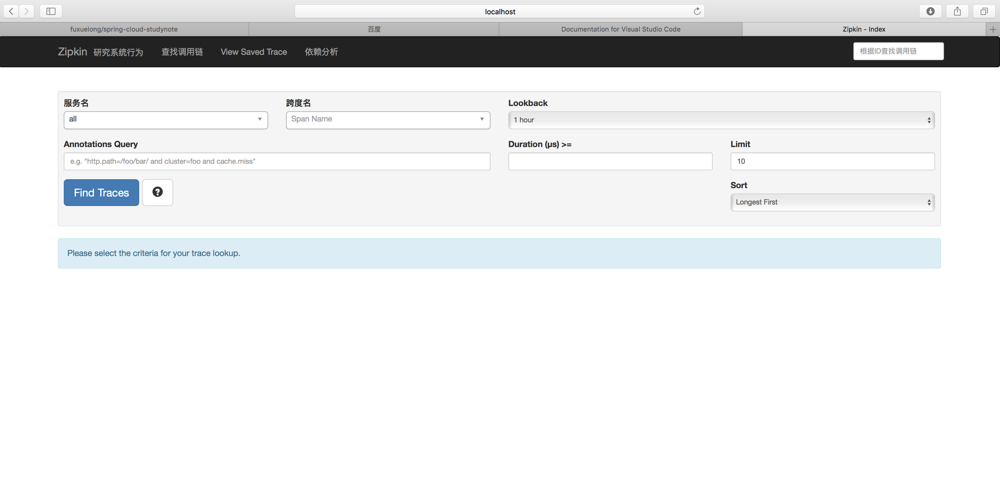
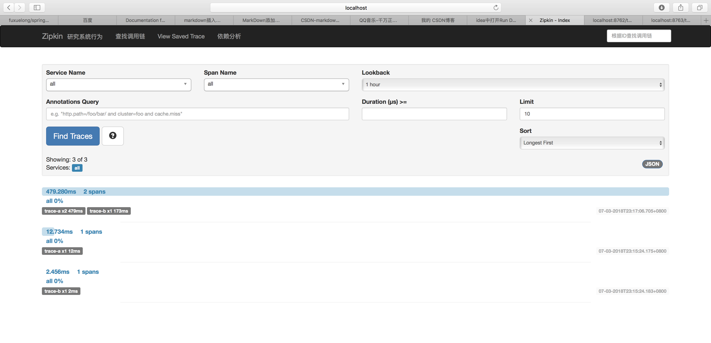
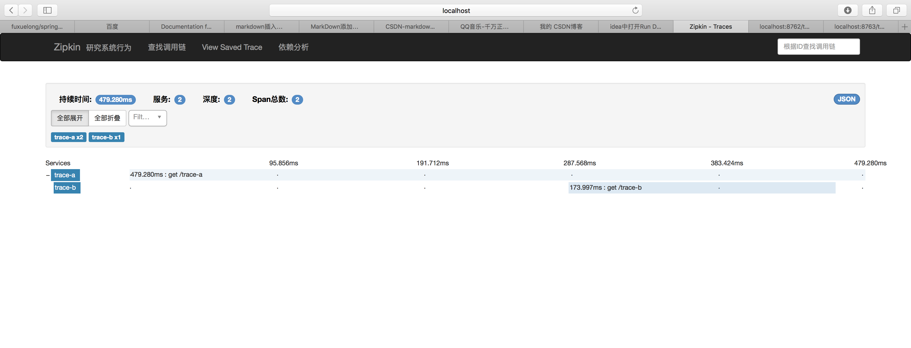

# 十一、Spring Cloud Sleuth
## （一） Spring Cloud Sleuth意义
 &emsp;一个微服务系统中会有众多微服务单元，业务也较为复杂，各个服务单元之间会相互消费，如果某一业务中的某一个服务节点出现问题，将会很难定位。所以在微服务系统中必须够进行链路追踪，对每个请求都能够清晰可见，记录展示请求都有哪些服务参与，这样可以在出现问题时能够快速定位。\
 &emsp;当前常见的链路追踪组件有Google的Dapper，Twitter的Zipkin，以及阿里的Eagleeye等。下面我们将讲解如何适用zipkin进行服务链路追踪。
## （二） 案例讲解
&emsp;再接下来的案例中使用Spring Boot的版本为2.0.3RELEASE，Spring Cloud的版本为Finchley.RELEASE,本案例采用Maven工程的多Module形式，工程中总共有三个module，eureka-server作为注册中心，trace-a、trace-b作为两个zipkin client，负责产生链路数据，并上传给链路追踪的服务中心。\
&emsp;需要特别注意的是在，Spring Boot 2.X以前，服务链路追踪的服务中心是需要自己创建的,但是在Spring Boot2.X版本之后，官方就不推荐自行定制服务端了，而是提供一个编译好的jar包供我们使用。

### 1. Eureka Server
    在编写服务注册中心eureka-server之前先建立一个Maven主工程sleuth-zipkin，在主Maven工程中引入其内部module所需的共同依赖：Spring Boot 2.0.3X和Spring Cloud Finchley.RELEASE,主Maven工程的pom文件如下：
```xml
<?xml version="1.0" encoding="UTF-8"?>
    <project xmlns="http://maven.apache.org/POM/4.0.0" xmlns:xsi="http://www.w3.org/2001/XMLSchema-instance"
         xsi:schemaLocation="http://maven.apache.org/POM/4.0.0 http://maven.apache.org/xsd/maven-4.0.0.xsd">
    <modelVersion>4.0.0</modelVersion>

    <groupId>com.example</groupId>
    <artifactId>demo</artifactId>
    <version>0.0.1-SNAPSHOT</version>
    <packaging>jar</packaging>

    <name>demo</name>
    <description>Demo project for Spring Boot</description>

    <parent>
        <groupId>org.springframework.boot</groupId>
        <artifactId>spring-boot-starter-parent</artifactId>
        <version>2.0.3.RELEASE</version>
        <relativePath/> <!-- lookup parent from repository -->
    </parent>

    <properties>
        <project.build.sourceEncoding>UTF-8</project.build.sourceEncoding>
        <project.reporting.outputEncoding>UTF-8</project.reporting.outputEncoding>
        <java.version>1.8</java.version>
        <spring-cloud.version>Finchely.RELEASE</spring-cloud.version>
    </properties>

    <dependencyManagement>
        <dependencies>
            <dependency>
                <groupId>org.springframework.cloud</groupId>
                <artifactId>spring-cloud-dependencies</artifactId>
                <version>${spring-cloud.version}</version>
                <type>pom</type>
                <scope>import</scope>
            </dependency>
        </dependencies>
    </dependencyManagement>

    <build>
        <plugins>
            <plugin>
                <groupId>org.springframework.boot</groupId>
                <artifactId>spring-boot-maven-plugin</artifactId>
            </plugin>
        </plugins>
    </build>
</project>
```
&emsp;创建完Maven主工程后，在主工程下面创建一个新的module工程，命名为eureka-server，作为微服务的注册中心，在eureka-server的pom文件中集成主Maven工程，引入eureka server所需的起步依赖spring-cloud-starter-netflix-eureka-server、spring-boot-starter-test，该pom文件如下：
```xml
<parent>
    <groupId>com.cnhtcqk</groupId>
    <artifactId>sleuth-zipkin</artifactId>
    <version>1.0-SNAPSHOT</version>
</parent>

<dependencies>
    <dependency>
        <groupId>org.springframework.cloud</groupId>
        <artifactId>spring-cloud-starter-netflix-eureka-server</artifactId>
    </dependency>

    <dependency>
        <groupId>org.springframework.boot</groupId>
        <artifactId>spring-boot-starter-test</artifactId>
        <scope>test</scope>
    </dependency>
</dependencies>

<build>
    <plugins>
        <plugin>
            <groupId>org.springframework.boot</groupId>
            <artifactId>spring-boot-maven-plugin</artifactId>
        </plugin>
    </plugins>
</build>
```
&emsp;在配置文件application.yml文件中做相关配置：
```yml
#指定端口为8761
server:
  port: 8761
#防止eureka-server注册自己，同时配置注册中心注册地址
eureka:
  client:
    register-with-eureka: false
    fetch-registry: false
    service-url:
      defaultzone: http://localhost:${server.port}/eureka/
```
&emsp;在工程的启动类EurekaServerApplication中添加注解@EnableEurekaServer打开作为注册中心的功能，代码如下：
```java
@SpringBootApplication
@EnableEurekaServer
public class EurekaServerApplication {
    public static void main(String[] args) {
        SpringApplication.run(EurekaServerApplication.class, args);
    }
}
```
### 2. zipkin服务端
&emsp;在Spring Boot 2.X后需要下载官方提供的zipkin的jar包作为服务端，使用curl下载如下：在git命令行下运行下面语句，将会下载zipkin.jar到当前目录下。
```cmd
curl -sSL https://zipkin.io/quickstart.sh | bash -s
```
&emsp;zipkin.jar实际上就是一个spring Boot工程，可以使用java -jar的形式启动，如下
```cmd
java -jar zipkin.jar
```
&emsp;如果不指定zipkin server的端口，启动后将默认使用9411，此时访问http://localhost:9411/zipkin/将会看到以下界面：
### 3. zipkin客户端
&emsp;在主Maven工程下新建一个module工程，命名为trace-a，需要引入以下依赖：
```xml
<dependency>
    <groupId>org.springframework.boot</groupId>
    <artifactId>spring-boot-starter-webflux</artifactId>
</dependency>
<dependency>
    <groupId>org.springframework.cloud</groupId>
    <artifactId>spring-cloud-starter-netflix-eureka-client</artifactId>
</dependency>
<dependency>
    <groupId>org.springframework.cloud</groupId>
    <artifactId>spring-cloud-starter-sleuth</artifactId>
</dependency>
<dependency>
    <groupId>org.springframework.cloud</groupId>
    <artifactId>spring-cloud-starter-zipkin</artifactId>
</dependency>
```
&emsp;在配置文件application.yml中做如下配置：
```yml
spring:
  application:
    name: trace-a #指定工项目名
  sleuth:
    web:
      client:
        enabled: true #打开sleuth客户端功能
    sampler:
      probability: 1.0 #将采样比设置为1，全部采样，默认为0.1
  zipkin:
    base-url: http://localhost:9411/ #指定链路追踪服务地址
server:
  port: 8762 
eureka:
  client:
    service-url:
      defaultzone: http://localhost:8761/eureka/ #指定服务注册中心地址
```
&emsp;Spring Cloud Finchley.RELEASE版本正式发布后，增加的一个新特性就是在引入eureka-client启动依赖后不需要在启动类中配置注解@EnableEurekaClient,spirng cloud会自动开启向注册中心注册功能，如果不需要开启注册功能只需要在配置文件中配置eureka.client.enable=false\
&emsp;按照上述的方法建立第二个zipkin客户端，命名为trace-b,trace-b的创建方法和trace-a基本一致，不同的知识配置文件中的spring.application.name和server.port两项。
&emsp;在trace-a工程下启动类下添加接口用来测试链路追踪，代码如下:
trace-a启动类
```java
@SpringBootApplication
@EnableEurekaClient
@RestController

public class TraceAApplication {

    public static void main(String[] args) {
        SpringApplication.run(TraceAApplication.class, args);
    }

    @Autowired
    private LoadBalancerExchangeFilterFunction lbFunction;

    @Bean
    public WebClient webClient() {
        return WebClient.builder().baseUrl("http://trace-b")
                .filter(lbFunction)
                .build();
    }

    @GetMapping("/trace-a")
    public Mono<String> trace() {
        System.out.println("===call trace-a===");

        return webClient().get()
                .uri("/trace-b")
                .retrieve()
                .bodyToMono(String.class);
    }
}
```
trace-b启动类
```java
@SpringBootApplication
@EnableEurekaClient
@RestController
public class TraceBApplication {

    public static void main(String[] args) {
        SpringApplication.run(TraceBApplication.class, args);
    }

    @GetMapping("/trace-b")
    public Mono<String> trace() {
        System.out.println("===call trace-b===");

        return Mono.just("Trace");
    }
}
```
&emsp;从上面的可以看出，调用/trace-a接口时，/trace-a接口会调用/trace-b接口。
分别启动eureka-server、zipkin、trace-a、trace-b，分别访问http:localhost:8762/trace-a和http:localhost:8763/trace-b,这时访问http:localhost:9411/zipkin/并点击Find Trace按钮可以看到链路追踪的记录，如下图所示：


点击每一条记录进去可以看到每一个服务的时间和顺序。\


### 4.使用rabbitMQ传输链路数据
&emsp;在上述例子中zipkin server 是通过http收集链路数据的，下面讲解如何使用消息组件RabbitMQ获取链路数据。
